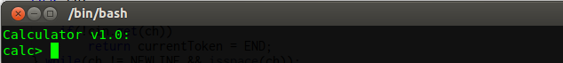

calculator
==========

This is a calculator repl that is based on an example from Stroustrup's C++ book.


It can add, multiply, subtract, and divide numbers:

```
calc> 1+1
>> 2
calc> 4 + 3 * 2
>> 10
calc> (4 + 3) * 2
>> 14
calc> 1/5
>> 0.2
```

You can create variables and use them in expressions:

```
calc> ticketsSold = 27
>> 27
calc> price = 30.00
>> 30
calc> income = ticketsSold * price
>> 810
```

You can use a `;` to delimit expressions:

```
calc> cookiesPerDay = 5; days = 10; cookiesConsumed = cookiesPerDay*days;
>> 5
calc> >> 10
calc> >> 50
```

It's odd sometimes:
```
calc> ;;;;;
calc> calc> calc> calc> calc> calc>
```

And that's about it!

